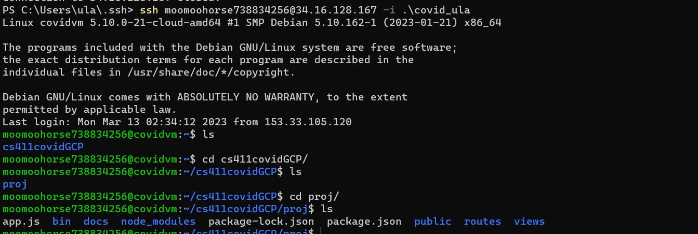
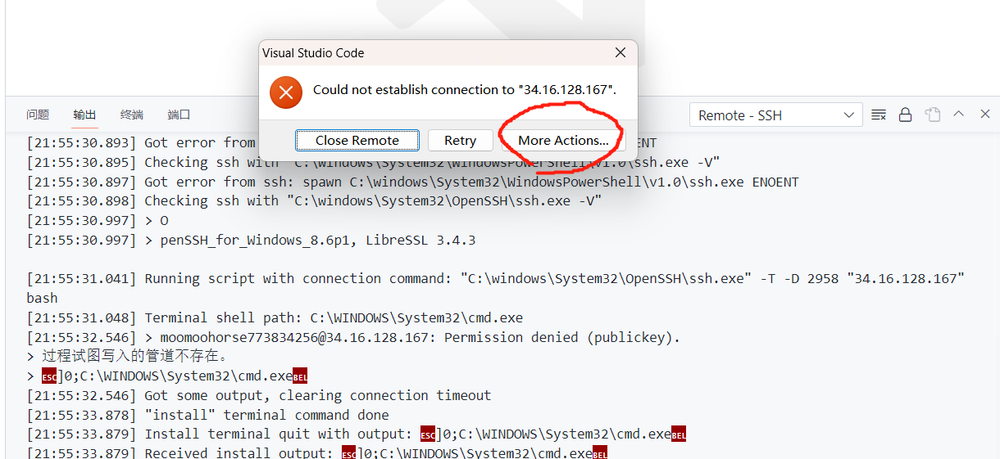
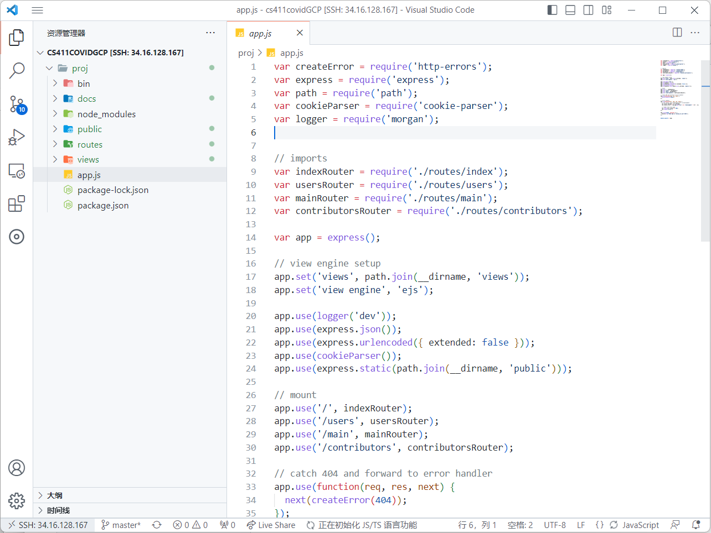

## How to get access to the vm on GCP using ssh

### generate a ssh key
1. Open a terminal you like and do `cd ~/.ssh` then type in `ssh-keygen -t rsa -f [KEY_FILENAME] -C [USERNAME]`. The username should be "rhao8608". For example, `ssh-keygen -t rsa -f covid_ula -C rhao8608`.
2. The message shows "Enter passphrase (empty for no passphrase):", and you can simply press enter twice
3. Use `cd ~/.ssh` then type `ls` and you should be able to see a pair of your keys, "keyname", "keyname.pub"
4. open "keyname.pub" with a text editor and copy the content. Ask the GCP administrator(Ren Hao) to add your ssh key.
5. Now you can connect to the vm using `ssh rhao8608@34.16.138.110 -i ./keyname`.



### ssh connect with VScode
1. use <kbd>Ctrl</kbd> + <kbd>Shift</kbd> + <kbd>p</kbd> and search "ssh connect". Choose "Remote-SSH: Connect to Host...".
2. Then click on "Add new SSH Host..." and type in `ssh rhao8608@34.16.138.110`. Choose the first one "\.ssh\config" and click on "Connect" on the bottom right window.
3. Select "Linux", then it would pop up an error "Could not establish...". Click on "More Actions" and choose "Open SSH Configuration File", then click on first one "\.ssh\config"

4. revise the config file as follow
```linux
Host 34.16.138.110
  HostName 34.16.138.110
  User rhao8608
  IdentityFile "C:\Users\<username>\.ssh\<your_keyname>"
```

Example:
```
Host 34.16.138.110
  HostName 34.16.138.110
  User rhao8608
  IdentityFile "C:\Users\ula\.ssh\covid_ula"
```

5. close the window and reconncect to ssh by step 1. (select the ssh you created) Now you should be able to connect to the vm.
6. select cs411covidGCP folder to work on it.



